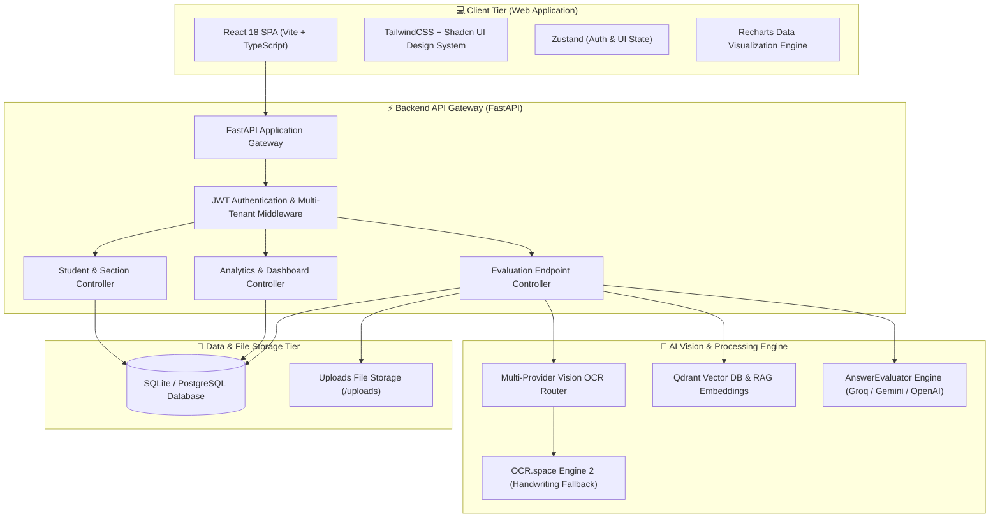
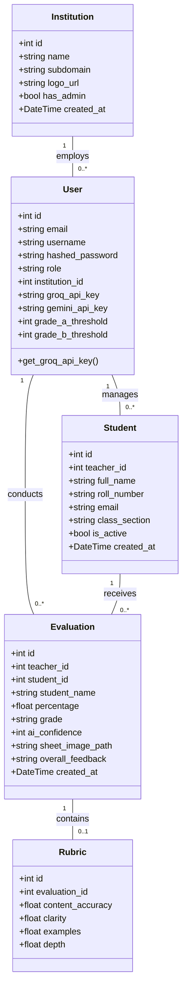
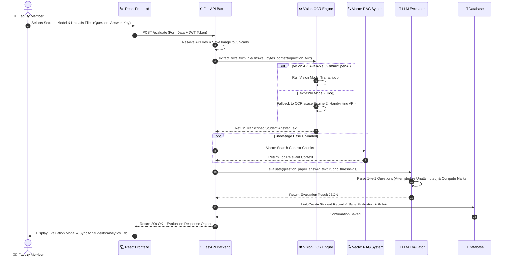
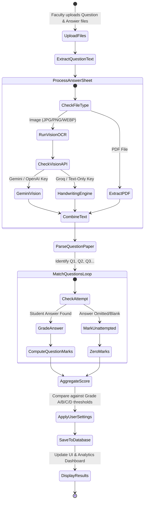
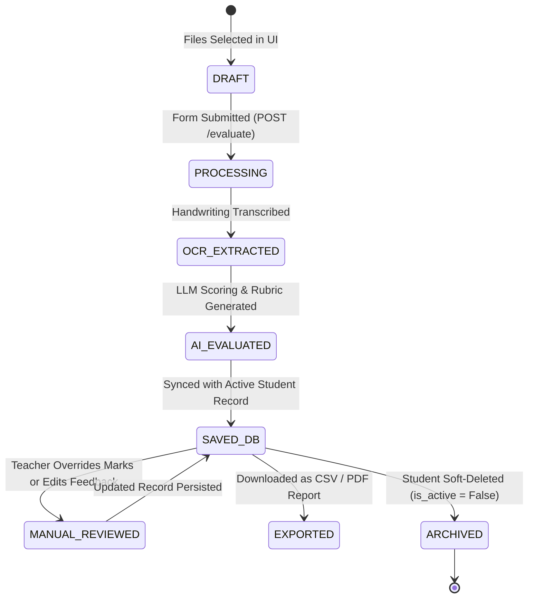

# 📄 SmartGrade AI — Abstract & Comprehensive UML Diagrams

**Project Title:** SmartGrade AI — Automated Exam Sheet Evaluation & Institution Analytics Platform  
**Documentation Purpose:** Official Project Abstract, System Architecture, and Standard UML Modeling Diagrams.

---

## 📝 1. Project Abstract

### Executive Summary
Traditional paper-based examination evaluation in educational institutions is inherently labor-intensive, time-consuming, and prone to subjective bias or evaluator fatigue. Furthermore, academic leadership often lacks real-time, quantitative visibility into student learning outcomes across different departments, class sections, and faculty members.

**SmartGrade AI** is a state-of-the-art, multi-tenant web platform designed to automate and streamline the evaluation of handwritten and digital student answer sheets. Built with a modern **React + Vite** frontend and a **FastAPI (Python)** micro-service backend, the system integrates a **Multi-Provider Vision OCR Engine** (supporting Google Gemini 1.5/2.0, Groq Llama 3.3, OpenAI GPT-4o, Anthropic Claude, and OCR.space Engine 2) to accurately transcribe complex cursive, faint, or messy human handwriting.

To ensure contextual grading accuracy, SmartGrade AI incorporates **Retrieval-Augmented Generation (RAG)** over embedded textbook knowledge bases and model answer keys. The evaluation engine automatically parses question papers, detects max marks, maps student answers 1-to-1 against each question (explicitly identifying unattempted questions), and computes similarity scores, earned marks, missing points, and custom grade assignments (A, B, C, D, F) based on user-predefined grading thresholds.

An interactive **Manual Review Workspace** provides educators with side-by-side answer sheet image inspection, real-time mark overrides, and feedback editing, ensuring complete teacher control. Concurrently, an **Institution Stats & Analytics Dashboard** provides college leadership with real-time class averages, passing rates, active student enrollments, performance trends, and grade distribution charts. Scoped multi-tenant data architecture guarantees strict privacy and security across institutions.

**Key Technical Keywords:** Artificial Intelligence, Vision OCR, Retrieval-Augmented Generation (RAG), Automated Answer Sheet Evaluation, Handwriting Transcription, FastAPI, React, Multi-Tenant System, Educational Analytics.

---

## 📐 2. UML Diagrams

---

### 2.1 Use Case Diagram (UML)

The Use Case Diagram illustrates the interactions between system actors (Faculty Member, Institution Administrator, and AI System) and the core platform features.

```mermaid
graph TD
    %% Actors
    Faculty["👨‍🏫 Faculty Member"]
    Admin["🏛️ Institution Admin"]
    AISystem["🤖 AI & OCR Subsystem"]

    %% Use Cases
    UC1["Select Institution Portal & Login"]
    UC2["Upload Exam Sheets (Question, Answer, Key)"]
    UC3["Configure Model & Strictness Settings"]
    UC4["Run Vision OCR & Handwriting Extraction"]
    UC5["Perform RAG Context & Semantic Evaluation"]
    UC6["Inspect Results & Manual Grade Override"]
    UC7["Manage Students & Class Sections"]
    UC8["View Institution Stats & Analytics Dashboard"]
    UC9["Export Reports (CSV / PDF)"]
    UC10["Manage Faculty Accounts & Portal Settings"]

    %% Relationships
    Faculty --> UC1
    Faculty --> UC2
    Faculty --> UC3
    Faculty --> UC6
    Faculty --> UC7

    Admin --> UC1
    Admin --> UC7
    Admin --> UC8
    Admin --> UC9
    Admin --> UC10

    UC2 .-> UC4 : <<include>>
    UC4 .-> UC5 : <<include>>
    AISystem --> UC4
    AISystem --> UC5
```

---

### 2.2 System Architecture Diagram

This component block diagram outlines the decoupled multi-tier architecture of SmartGrade AI, spanning the Client Tier, API Gateway Tier, Processing Services, AI Engines, and Storage Systems.



---

### 2.3 Class Diagram (UML Data Model)

The UML Class Diagram defines the entity relationships, attributes, and primary data models powering the backend SQLite/PostgreSQL database and FastAPI schemas.



---

### 2.4 Sequence Diagram (Evaluation Lifecycle)

This sequence diagram traces the complete execution flow when a faculty member submits an answer sheet for automated evaluation.



---

### 2.5 Activity Diagram (Exam Sheet Processing Workflow)

The Activity Diagram captures the conditional logic, fallback decision trees, and processing steps during exam evaluation.



---

### 2.6 State Machine Diagram (Evaluation Entity Lifecycle)

This state machine diagram displays the various states an evaluation entity moves through from initial upload to final archiving.



---

## 📌 Summary Checklist for Project Reports & Presentations

| Diagram Type | Status | Key Highlights Included |
| :--- | :--- | :--- |
| **Abstract** | ✅ Complete | Problem statement, Multi-Provider OCR, RAG, Analytics, Security. |
| **Use Case Diagram** | ✅ Complete | Faculty, Admin, AI Subsystem interactions. |
| **System Architecture** | ✅ Complete | Client Tier, FastAPI Gateway, AI Engine, Storage Tier. |
| **Class Diagram** | ✅ Complete | User, Institution, Student, Evaluation, Rubric schemas & cardinality. |
| **Sequence Diagram** | ✅ Complete | End-to-end trace from upload to database persistence. |
| **Activity Diagram** | ✅ Complete | Vision fallback decision tree & attempted/unattempted grading loop. |
| **State Machine Diagram**| ✅ Complete | Lifecycle states from Draft to Saved, Overridden, and Archived. |

---

*Generated for the SmartGrade AI Project Team.*
