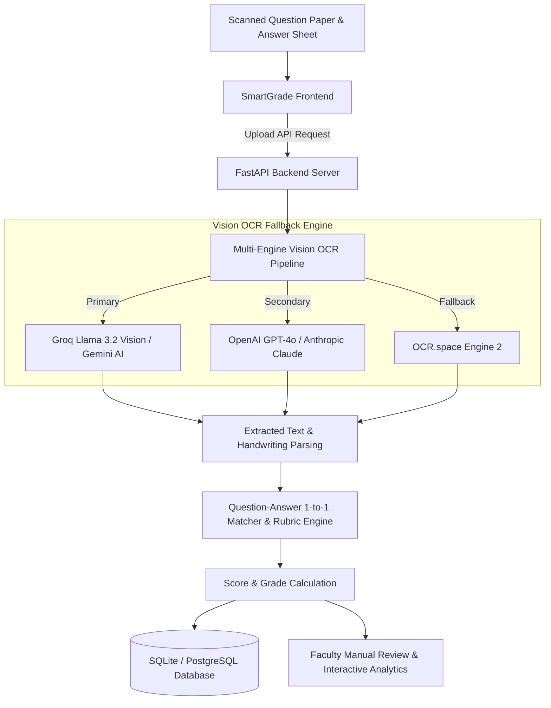

<div align="center">
  <h1>🎓 SmartGrade AI</h1>
  <p><b>Multi-Tenant AI-Powered Exam & Handwritten Answer Sheet Evaluation System</b></p>

  [](https://fastapi.tiangolo.com/)
  [](https://reactjs.org/)
  [](https://www.typescriptlang.org/)
  [](https://tailwindcss.com/)
  [](https://ai.google.dev/)
  [](https://www.docker.com/)
</div>

---

## 📌 Executive Overview

**SmartGrade AI** is an enterprise-grade, multi-tenant web application designed to automate the transcription, scoring, and analysis of physical handwritten exam papers. Built for modern educational institutions, schools, and universities, SmartGrade AI combines multi-provider **Vision OCR pipelines** with intelligent LLMs to evaluate student answer sheets accurately based on question papers and customizable grading rubrics.

---

## ✨ Key Features & Capabilities

### 📷 1. Multi-Provider Vision OCR & Handwriting Recognition
- Multi-engine fallback system leveraging **Groq Llama Vision**, **Google Gemini AI**, **OpenAI GPT-4o**, **Anthropic Claude**, **Mistral**, and **OCR.space Engine 2**.
- Accurately transcribes diverse human handwriting styles from scanned image uploads (`.png`, `.jpg`, `.jpeg`) and PDF documents.

### 🎯 2. Intelligent Question-to-Answer Matching
- Parses question papers to identify total question counts and maximum mark allocations.
- Automatically maps student handwriting snippets to specific questions.
- Detects **unattempted questions** and assigns scores accordingly without manual intervention.

### 📝 3. AI Rubrics & Automated Evaluation
- Evaluates student responses based on accuracy, key concept inclusion, and clarity.
- Generates itemized mark breakdowns, detailed feedback comments, and overall percentage scores.
- Adheres to institution-configurable grade thresholds ($A, B, C, D$).

### 📊 4. Interactive Analytics & Faculty Dashboards
- **Faculty Dashboard:** Live grading performance, class average scores, grade distribution pie charts, and recent evaluation history.
- **Student Performance Analytics:** Tracks individual student progress, active student metrics, and class-wide statistics.
- **Manual Review & Override:** Allows faculty members to inspect AI evaluation results, override specific question scores, add feedback, and re-calculate final grades.

### 🏫 5. Multi-Tenancy & Custom White-Labeling
- Separate workspaces for institutions with dedicated subdomains (e.g., `sivasivani.smartgrade.ai`).
- White-label customization including custom logos, dynamic acronym avatar badges, and institution accent color themes.
- Role-Based Access Control (**RBAC**): `Super Admin`, `Institution Admin`, and `Faculty / Teacher`.

### 🔐 6. Authentication & Security
- Secure JWT bearer token authentication.
- Email / Mobile OTP verification for registration.
- Email OTP Password Reset workflow dispatched via Gmail SMTP.

---

## 🏗️ System Architecture & Workflow



---

## 📁 Directory Structure

```text
Smart Grade AI/
├── backend/                  # FastAPI Backend Application
│   ├── main.py               # REST API Endpoints & Auth Handlers
│   ├── rag_engine.py         # AI RAG & Context Query Engine
│   └── requirements.txt      # Python Dependencies
├── database/                 # Database Layer
│   ├── db.py                 # SQLAlchemy Session Setup
│   └── models.py             # Database Schemas (User, Institution, Evaluation, Student)
├── smartgrade-frontend/      # React + TypeScript + Vite Frontend
│   ├── src/
│   │   ├── api/              # Axios API Client & Endpoints
│   │   ├── components/       # UI Components & Layouts
│   │   ├── pages/            # Page Views (Dashboard, Evaluate, Analytics, ManualReview)
│   │   └── store/            # Zustand Auth Store
│   ├── package.json          # Frontend Dependencies
│   └── tailwind.config.js    # Tailwind CSS Styling Config
├── evaluator.py              # Vision OCR & Rubric Scoring Logic
├── rubric_generator.py       # AI Rubric Builder
├── utils.py                  # Utility Helpers (PDF Parsing, Image Preprocessing)
├── Dockerfile                # Docker Container Definition
├── docker-compose.yml        # Multi-Container Orchestration
├── ABSTRACT_AND_UML_DIAGRAMS.md # UML & System Design Documentation
└── PROJECT_PRESENTATION.md   # Presentation Structure for Team Members
```

---

## 🚀 Quick Start Guide

### Prerequisites
- **Python 3.10+**
- **Node.js 18+** & **npm**
- **Git**

---

### 1. Clone the Repository
```bash
git clone https://github.com/Praneesh-Gattadi/SMART_GRADE-AI.git
cd SMART_GRADE-AI
```

---

### 2. Backend Setup
```bash
# Navigate to backend directory
cd backend

# Create & activate a Python Virtual Environment
python -m venv ../venv
..\venv\Scripts\activate   # On Windows (PowerShell / CMD)
# source ../venv/bin/activate # On Linux / macOS

# Install dependencies
pip install -r requirements.txt

# Start the FastAPI Uvicorn Server
python main.py
```
> 📍 **Backend Server:** `http://localhost:8000`  
> 📑 **Interactive API Docs (Swagger):** `http://localhost:8000/api/docs`

---

### 3. Frontend Setup
```bash
# Navigate to frontend directory
cd smartgrade-frontend

# Install Node modules
npm install

# Start the Vite Development Server
npm run dev
```
> 📍 **Frontend App:** `http://localhost:5173/`

---

## 🐳 Docker Deployment

To launch the full-stack application using Docker:

```bash
docker-compose up --build -d
```

---

## 📑 Additional Documentation

- 📐 **[UML Diagrams & Abstract Documentation](ABSTRACT_AND_UML_DIAGRAMS.md)**
- 📊 **[Team Presentation Plan](PROJECT_PRESENTATION.md)**

---

## 📜 License

Distributed under the **MIT License**. See `LICENSE` for more information.
